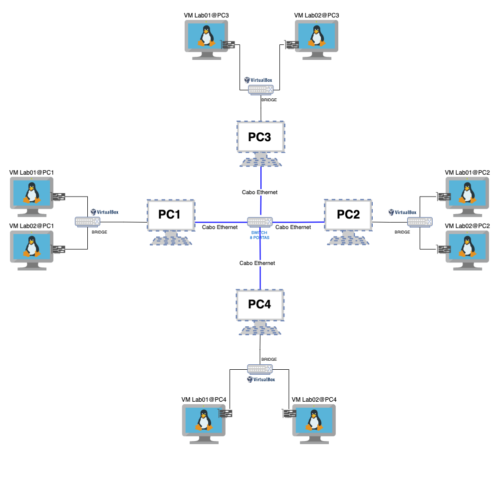

# Projeto Final - Fundamentos de Redes de Computadores

**Instituição:** IFAL - Campus Maceió  
**Disciplina:** Fundamentos de Redes de Computadores  
**Professor:** [Alaelson de Castro Jatoba Neto](mailto:alaelson@ifal.edu.br)  
**Curso:** Bacharelado em Sistemas de Informação (BSI)  
**Turma:** bsi-26-1 (2026.1)  
**Grupo:** 4 (G4)  

**Repositório:** [github.com/quokequack/virtual-box-projeto-final](https://github.com/quokequack/virtual-box-projeto-final)

---

## 1. Visão geral

Este repositório documenta a construção de um ambiente de rede virtualizada composto
por **8 máquinas virtuais (VMs)** executando o sistema operacional **Ubuntu Server**,
conforme especificação do projeto final da disciplina.

O ambiente reproduz, em escala reduzida, uma rede local segmentada por sub-redes, na
qual cada host possui endereçamento IP estático, identificação por nome totalmente
qualificado (FQDN), resolução de nomes local e acesso administrativo via SSH. O objetivo
pedagógico é exercitar, de ponta a ponta, os conceitos de **endereçamento IPv4**,
**sub-redes (subnetting) com máscara /28**, **nomenclatura de hosts e domínios**,
**resolução de nomes** e **acesso remoto seguro**.

A documentação está dividida em:

| Documento | Conteúdo |
|-----------|----------|
| `README.md` (este arquivo) | Visão geral, integrantes, tabelas de hardware, IPs e nomenclatura, topologia e estrutura do repositório. |
| [`docs/passo-a-passo.md`](docs/passo-a-passo.md) | Tutorial técnico detalhado de instalação e configuração de cada VM, com a fundamentação de cada decisão. |
| [`docs/testes-ping.md`](docs/testes-ping.md) | Resultados dos testes de conectividade (ping) entre VMs por IP e FQDN. |
| [`docs/testes-ssh.md`](docs/testes-ssh.md) | Resultados dos testes de acesso remoto (SSH) com hostnames e usuários criados. |
| `VMs/G4-PCx-VMy.md` | Ficha individual de cada VM (hostname, IP, responsável, link do Drive). |
| [Google Drive - pasta das VMs](https://drive.google.com/drive/folders/1p69GdlGW5U2qTsmPozNy9VVHgqpojhB-?usp=sharing) | Arquivos das VMs nos formatos `.ova` e `.vdi` para download. |

---

## 2. Integrantes do grupo

| Nome completo | Usuário (login) | E-mail | GitHub | Máquinas |
|---------------|-----------------|--------|--------|----------|
| Andrezza Abreu de Magalhães | `andrezza.magalhaes` | aam6@aluno.ifal.edu.br | [@dzzabreu](https://github.com/dzzabreu) | G4-PC1-VM1, G4-PC1-VM2 |
| Isaque de Souza Braga | `isaque.braga` | isb15@aluno.ifal.edu.br | [@isaquebraga](https://github.com/isaquebraga) | G4-PC2-VM1, G4-PC2-VM2 |
| Maria Luisa Alaquoke Ferreira dos Santos | `maria.santos` | mlafs2@aluno.ifal.edu.br | [@quokequack](https://github.com/quokequack) | G4-PC3-VM1, G4-PC3-VM2 |
| Renilson José da Silva Santos | `renilson.santos` | rjss7@aluno.ifal.edu.br | [@renilsou](https://github.com/renilsou) | G4-PC4-VM1, G4-PC4-VM2 |

> Cada integrante é o **administrador** (membro do grupo `sudo`) das duas máquinas sob sua
> responsabilidade. Ainda assim, em **todas** as VMs são criados os usuários de **todos**
> os integrantes, conforme exigência do projeto.

---

## 3. Topologia da rede

A topologia adotada segue o diagrama de referência fornecido na especificação do projeto
(Figura 1). As 8 VMs pertencem à mesma sub-rede `192.168.26.48/28`, comunicando-se em
camada de enlace por meio de uma rede interna virtual do hipervisor.



---

## 4. Configuração de hardware das VMs

Todas as VMs foram criadas com configuração idêntica, dimensionada para o papel de
servidor leve (Ubuntu Server, sem ambiente gráfico):

| Recurso | Especificação | Justificativa |
|---------|---------------|---------------|
| Memória RAM | 2048 MB (2 GB) | Adequado para o Ubuntu Server em modo texto e os serviços do projeto (SSH), permitindo operações mais fluidas. |
| Processador | 2 vCPU (2 núcleos) | Garante melhor desempenho em operações do sistema e processamento de múltiplas conexões SSH simultâneas. |
| Disco | 32 GB | Acomoda o sistema base, pacotes adicionais (idioma, SSH) e margem para logs. |
| Sistema operacional | Ubuntu Server | Distribuição voltada a servidores, sem interface gráfica, alinhada ao objetivo do projeto. |
| Interface de rede | 1 adaptador (rede interna do hipervisor) | Conecta as VMs na mesma sub-rede isolada. |

---

## 5. Endereçamento IP

### 5.1. Fundamentação do subnetting

A turma **bsi-26-1** utiliza a rede **`192.168.26.0/24`**. Essa rede é dividida em
sub-redes de **máscara /28** (`255.255.255.240`), o que produz blocos de **16 endereços**
cada (2⁴ = 16), sendo **14 endereços úteis** por bloco (descontados endereço de rede e de
broadcast). A atribuição por grupo é sequencial:

| Grupo | Faixa (/28) | Rede | Broadcast |
|-------|-------------|------|-----------|
| Grupo 1 | 192.168.26.0 – 192.168.26.15 | .0 | .15 |
| Grupo 2 | 192.168.26.16 – 192.168.26.31 | .16 | .31 |
| Grupo 3 | 192.168.26.32 – 192.168.26.47 | .32 | .47 |
| **Grupo 4 (este)** | **192.168.26.48 – 192.168.26.63** | **.48** | **.63** |

Para o **Grupo 4**, portanto:

- **Endereço de rede:** `192.168.26.48`
- **Primeiro endereço útil:** `192.168.26.49`
- **Último endereço útil:** `192.168.26.62`
- **Endereço de broadcast:** `192.168.26.63`
- **Máscara:** `255.255.255.240` (`/28`)
- **Hosts úteis:** 14 (as 8 VMs ocupam `.49`–`.56`, restando `.57`–`.62` livres)

### 5.2. Tabela de endereços das VMs

| VM | Endereço IP | Máscara |
|----|-------------|---------|
| G4-PC1-VM1 | 192.168.26.49 | /28 (255.255.255.240) |
| G4-PC1-VM2 | 192.168.26.50 | /28 |
| G4-PC2-VM1 | 192.168.26.51 | /28 |
| G4-PC2-VM2 | 192.168.26.52 | /28 |
| G4-PC3-VM1 | 192.168.26.53 | /28 |
| G4-PC3-VM2 | 192.168.26.54 | /28 |
| G4-PC4-VM1 | 192.168.26.55 | /28 |
| G4-PC4-VM2 | 192.168.26.56 | /28 |

---

## 6. Nomenclatura e domínio (FQDN)

O domínio do grupo segue o formato definido pela disciplina. O nome curto (hostname) é usado
como **apelido (alias)** na resolução local, e o **FQDN** é o nome canônico do host.

| VM | Hostname | FQDN | Apelido (alias) | IP |
|----|----------|------|-----------------|-----|
| G4-PC1-VM1 | g4-pc1-vm1 | g4-pc1-vm1.grupo4-bsi-26-1.maceio.lab | g4-pc1-vm1 | 192.168.26.49 |
| G4-PC1-VM2 | g4-pc1-vm2 | g4-pc1-vm2.grupo4-bsi-26-1.maceio.lab | g4-pc1-vm2 | 192.168.26.50 |
| G4-PC2-VM1 | g4-pc2-vm1 | g4-pc2-vm1.grupo4-bsi-26-1.maceio.lab | g4-pc2-vm1 | 192.168.26.51 |
| G4-PC2-VM2 | g4-pc2-vm2 | g4-pc2-vm2.grupo4-bsi-26-1.maceio.lab | g4-pc2-vm2 | 192.168.26.52 |
| G4-PC3-VM1 | g4-pc3-vm1 | g4-pc3-vm1.grupo4-bsi-26-1.maceio.lab | g4-pc3-vm1 | 192.168.26.53 |
| G4-PC3-VM2 | g4-pc3-vm2 | g4-pc3-vm2.grupo4-bsi-26-1.maceio.lab | g4-pc3-vm2 | 192.168.26.54 |
| G4-PC4-VM1 | g4-pc4-vm1 | g4-pc4-vm1.grupo4-bsi-26-1.maceio.lab | g4-pc4-vm1 | 192.168.26.55 |
| G4-PC4-VM2 | g4-pc4-vm2 | g4-pc4-vm2.grupo4-bsi-26-1.maceio.lab | g4-pc4-vm2 | 192.168.26.56 |

---

## 7. Estrutura do repositório

```
virtual-box-projeto-final/
├── README.md                     # Este documento (visão geral + tabelas)
├── topologia-projeto.png         # Imagem da topologia da rede
├── .gitignore
├── docs/
│   ├── passo-a-passo.md          # Tutorial técnico detalhado
│   ├── testes-ping.md            # Resultados dos testes de conectividade (ping)
│   └── testes-ssh.md             # Resultados dos testes de acesso remoto (SSH)
├── evidencias/                   # Capturas de tela dos testes
│   ├── README.md                 # Guia para adicionar imagens
│   ├── ping-*.png                # Screenshots dos testes de ping
│   └── ssh-*.png                 # Screenshots dos testes de SSH
└── VMs/
    ├── G4-PC1-VM1.md             # Ficha da VM
    ├── G4-PC1-VM2.md
    ├── G4-PC2-VM1.md
    ├── G4-PC2-VM2.md
    ├── G4-PC3-VM1.md
    ├── G4-PC3-VM2.md
    ├── G4-PC4-VM1.md
    └── G4-PC4-VM2.md
```

Cada arquivo em `VMs/` contém a ficha individual da máquina com hostname, IP, responsável e link para a pasta da VM no Google Drive. Os arquivos `.ova` e `.vdi` não são versionados no repositório - cada pasta no Drive contém os dois formatos.

A pasta `evidencias/` contém os screenshots dos testes, com um guia de nomenclatura e instruções de como adicionar as imagens nos arquivos `.md`.

---

## 8. Cronograma e entregas

| Etapa | Prazo | Itens |
|-------|-------|-------|
| Etapa 1 | 11/06/2026 | Tabelas de definição de nomes e IPs (seções 5 e 6); criação da página do projeto no GitHub. |
| Etapa 2 (Final) | 18/06/2026 | Entrega e apresentação final do ambiente completo, com testes. |

---

## 9. Referências

- Especificação do Projeto Final - Fundamentos de Redes de Computadores, turma bsi-26-1 (2026.1).
- Repositório de referência da disciplina: <https://github.com/alaelson/labredes_virtualbox/blob/main/projeto-final/README.md>
- Documentação oficial do Netplan: <https://netplan.io/>
- Manual do Ubuntu Server: <https://ubuntu.com/server/docs>
