# Testes de Conectividade (Ping)

Nesta seção são apresentados os resultados dos testes de conectividade entre as VMs do Grupo 4, validando:
- Conectividade **por IP**
- Conectividade **por hostname** (nome curto)
- Conectividade **por FQDN** (nome totalmente qualificado)

Os comandos foram executados em sequência na mesma máquina, e uma única captura de tela documenta os 3 resultados.

---

## 1. Testes a partir de G4-PC1-VM1 (Andrezza)

Os testes foram executados em sequência na mesma máquina.

**Destino:** G4-PC2-VM1

```bash
ping -c 4 192.168.26.51
ping -c 4 g4-pc2-vm1
ping -c 4 g4-pc2-vm1.grupo4-bsi-26-1.maceio.lab
```

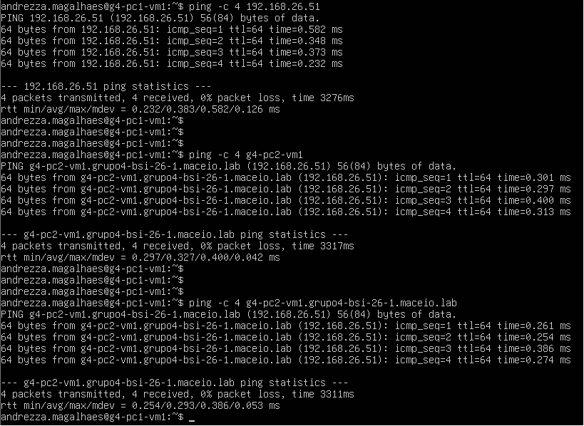

---

**Destino:** G4-PC3-VM1

```bash
ping -c 4 192.168.26.53
ping -c 4 g4-pc3-vm1
ping -c 4 g4-pc3-vm1.grupo4-bsi-26-1.maceio.lab
```

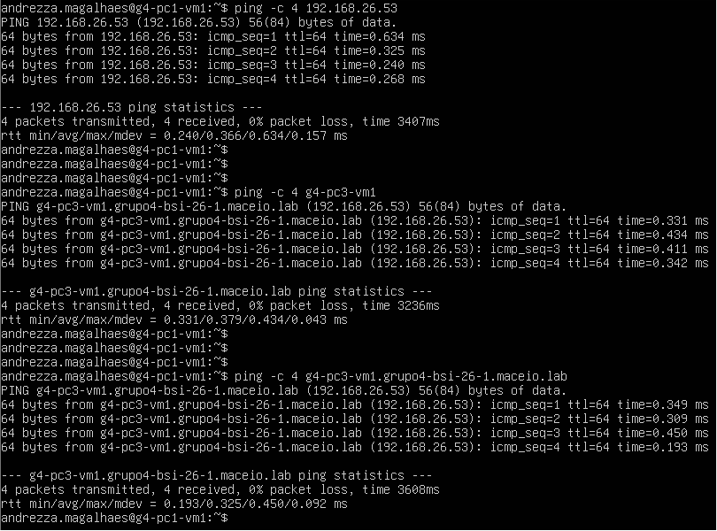

---

**Destino:** G4-PC4-VM1

```bash
ping -c 4 192.168.26.55
ping -c 4 g4-pc4-vm1
ping -c 4 g4-pc4-vm1.grupo4-bsi-26-1.maceio.lab
```

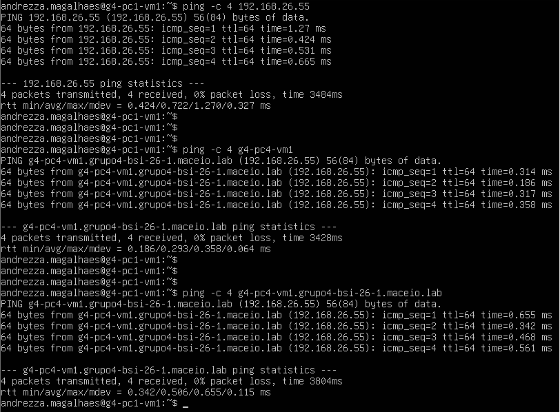

---

## 2. Testes a partir de G4-PC2-VM1 (Isaque)

Os testes foram executados em sequência na mesma máquina.

```bash
ping -c 4 192.168.26.49
ping -c 4 g4-pc1-vm1
ping -c 4 g4-pc1-vm1.grupo4-bsi-26-1.maceio.lab
```

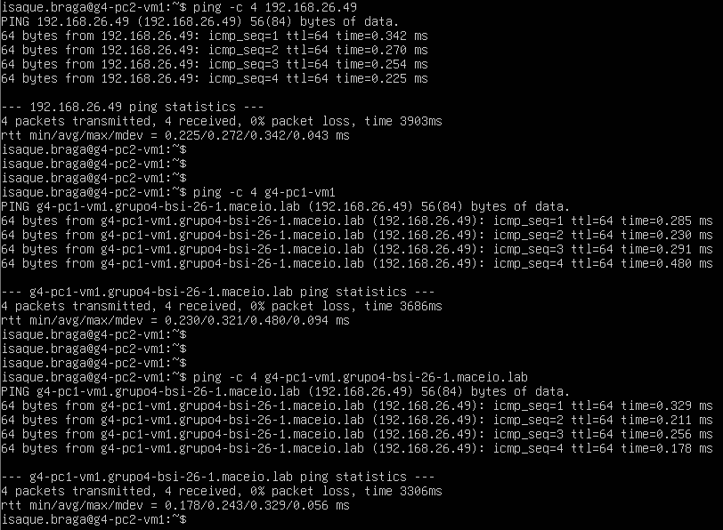

---

**Destino:** G4-PC3-VM1

```bash
ping -c 4 192.168.26.53
ping -c 4 g4-pc3-vm1
ping -c 4 g4-pc3-vm1.grupo4-bsi-26-1.maceio.lab
```

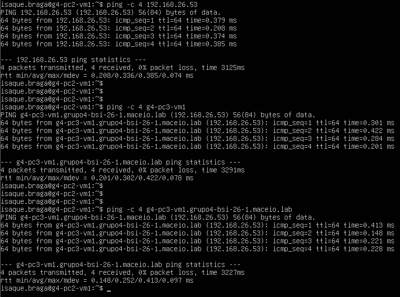

---

**Destino:** G4-PC4-VM1

```bash
ping -c 4 192.168.26.55
ping -c 4 g4-pc4-vm1
ping -c 4 g4-pc4-vm1.grupo4-bsi-26-1.maceio.lab
```

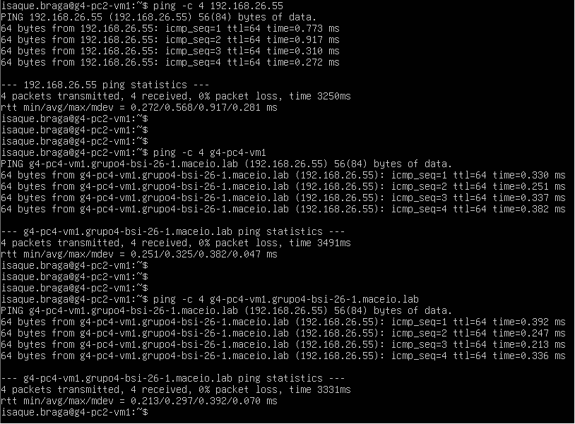

---

## 3. Testes a partir de G4-PC3-VM1 (Maria)

Os testes foram executados em sequência na mesma máquina.

```bash
ping -c 4 192.168.26.49
ping -c 4 g4-pc1-vm1
ping -c 4 g4-pc1-vm1.grupo4-bsi-26-1.maceio.lab
```

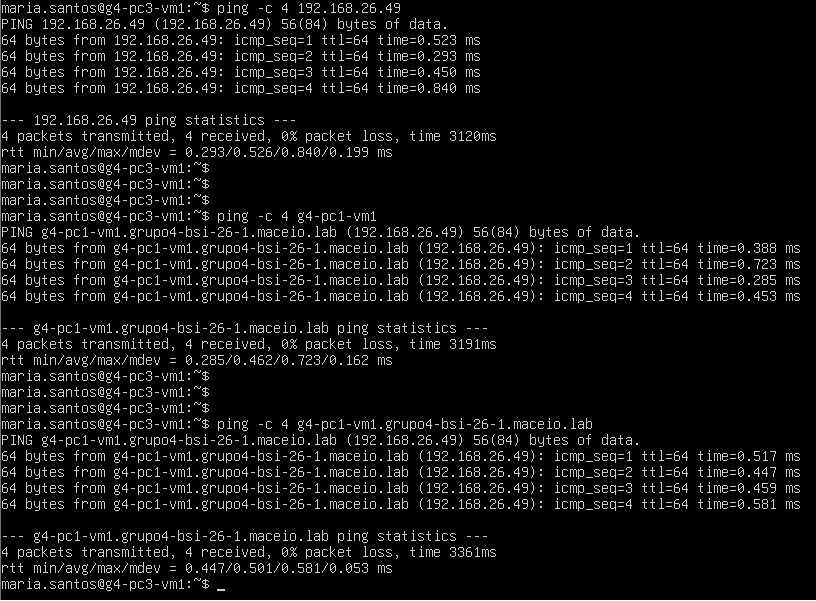

---

**Destino:** G4-PC2-VM1

```bash
ping -c 4 192.168.26.51
ping -c 4 g4-pc2-vm1
ping -c 4 g4-pc2-vm1.grupo4-bsi-26-1.maceio.lab
```

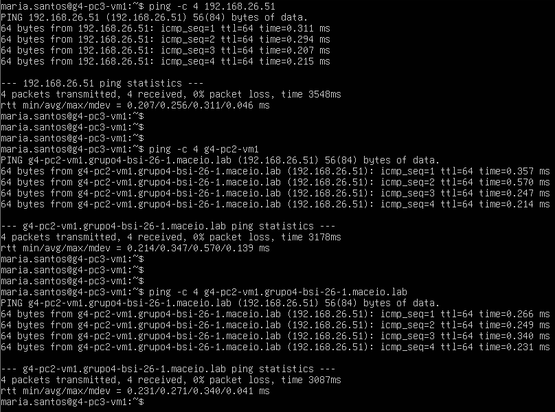

---

**Destino:** G4-PC4-VM1

```bash
ping -c 4 192.168.26.55
ping -c 4 g4-pc4-vm1
ping -c 4 g4-pc4-vm1.grupo4-bsi-26-1.maceio.lab
```

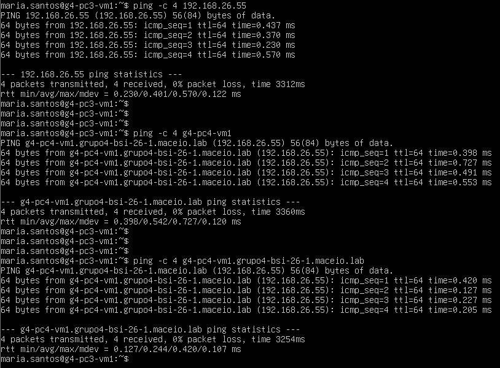

---

## 4. Testes a partir de G4-PC4-VM1 (Renilson)

Os testes foram executados em sequência na mesma máquina.

**Destino:** G4-PC1-VM1

```bash
ping -c 4 192.168.26.49
ping -c 4 g4-pc1-vm1
ping -c 4 g4-pc1-vm1.grupo4-bsi-26-1.maceio.lab
```

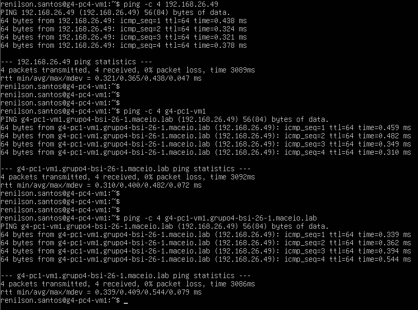

---

**Destino:** G4-PC2-VM1

```bash
ping -c 4 192.168.26.51
ping -c 4 g4-pc2-vm1
ping -c 4 g4-pc2-vm1.grupo4-bsi-26-1.maceio.lab
```

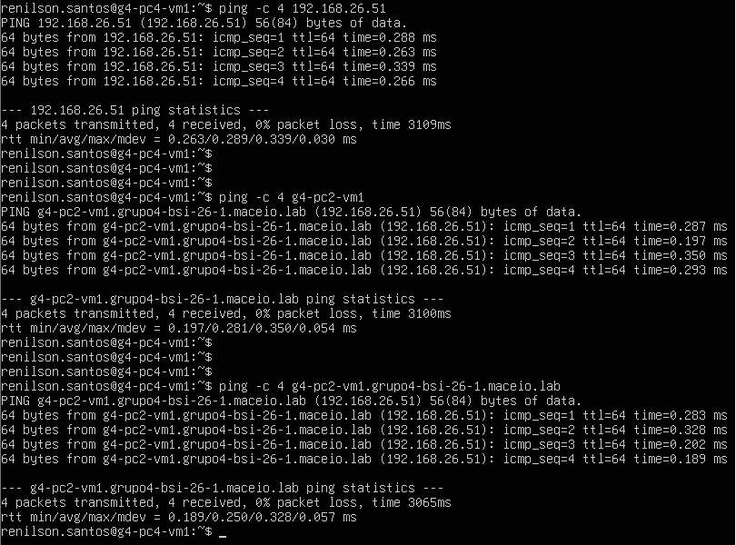

---

**Destino:** G4-PC3-VM1

```bash
ping -c 4 192.168.26.53
ping -c 4 g4-pc3-vm1
ping -c 4 g4-pc3-vm1.grupo4-bsi-26-1.maceio.lab
```

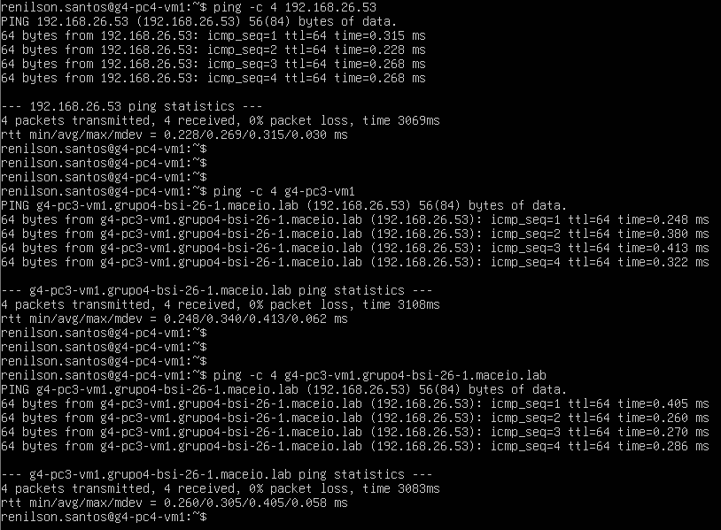

---

## 5. Testes aleatórios adicionais

Testes avulsos sem padrão fixo, cobrindo as VM2s e pares ainda não contemplados nas seções anteriores. Cada teste usa apenas um tipo de identificação (IP, hostname ou FQDN) para demonstrar que qualquer formato funciona em qualquer direção.

**G4-PC1-VM2 → G4-PC4-VM1** (IP)

```bash
ping -c 4 192.168.26.55
```

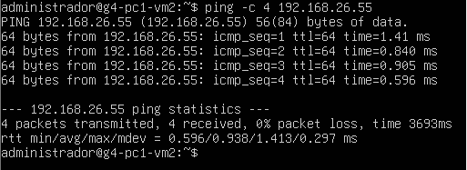

---

**G4-PC2-VM2 → G4-PC3-VM1** (FQDN)

```bash
ping -c 4 g4-pc3-vm1.grupo4-bsi-26-1.maceio.lab
```

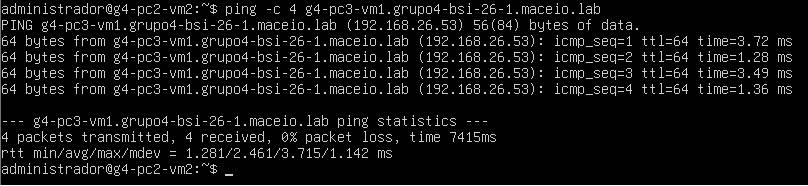

---

**G4-PC3-VM2 → G4-PC1-VM1** (hostname)

```bash
ping -c 4 g4-pc1-vm1
```

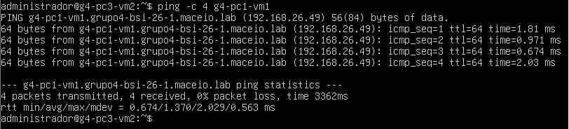

---

**G4-PC4-VM2 → G4-PC2-VM1** (IP)

```bash
ping -c 4 192.168.26.51
```

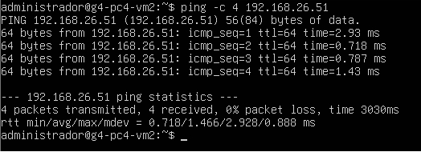

---

**G4-PC1-VM1 → G4-PC1-VM2** (hostname)

```bash
ping -c 4 g4-pc1-vm2
```


---

**G4-PC3-VM1 → G4-PC4-VM2** (FQDN)

```bash
ping -c 4 g4-pc4-vm2.grupo4-bsi-26-1.maceio.lab
```

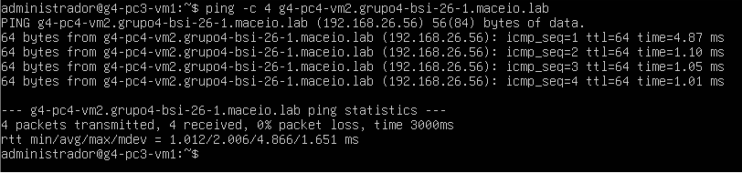

---

**G4-PC2-VM1 → G4-PC2-VM2** (IP)

```bash
ping -c 4 192.168.26.52
```

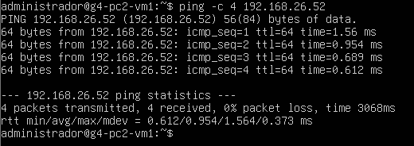

---

**G4-PC4-VM1 → G4-PC3-VM2** (hostname)

```bash
ping -c 4 g4-pc3-vm2
```

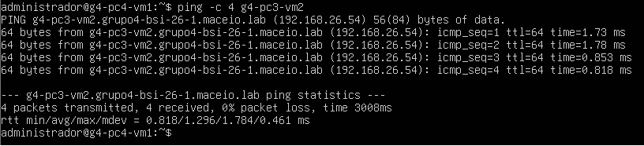

---

## 6. Resumo

**Total de testes:** 20 prints (12 originais + 8 aleatórios adicionais)

Todos os testes de ping foram bem-sucedidos, demonstrando:
- ✅ Conectividade entre todas as VMs
- ✅ Resolução de nomes funcionando corretamente (hostname)
- ✅ Resolução FQDN funcionando corretamente
- ✅ Mapeamento IP/hostname/FQDN consistente no `/etc/hosts`
