# Testes de Acesso Remoto (SSH)

Nesta seção são apresentados os resultados dos testes de acesso SSH das VMs do Grupo 4, validando:
- Acesso **por IP**
- Acesso **por hostname** (nome curto)
- Acesso **por FQDN** (nome totalmente qualificado)
- Funcionamento dos **usuários criados**

Para cada teste, executou-se o comando:
```bash
ssh [usuario]@[alvo]
```

---

## 1. Testes de Andrezza (andrezza.magalhaes)

### Em G4-PC1-VM1

Os testes foram executados e documentados nas imagens abaixo:

#### Por IP (192.168.26.49)
```bash
ssh andrezza.magalhaes@192.168.26.49
```


#### Por hostname (g4-pc1-vm1)
```bash
ssh andrezza.magalhaes@g4-pc1-vm1
```
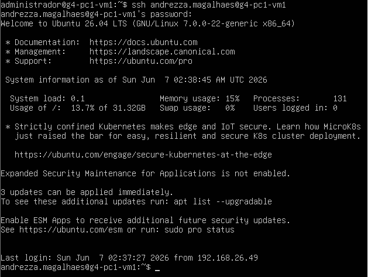

#### Por FQDN
```bash
ssh andrezza.magalhaes@g4-pc1-vm1.grupo4-bsi-26-1.maceio.lab
```
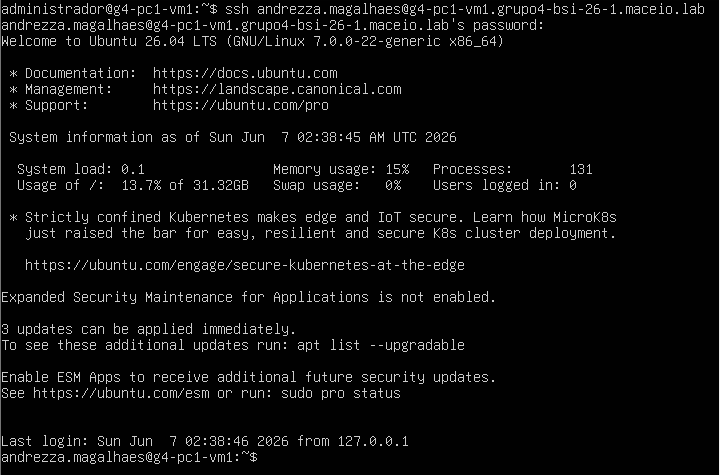

---

### Em G4-PC1-VM2

Os testes foram executados e documentados nas imagens abaixo:
```bash
ssh andrezza.magalhaes@192.168.26.50
```
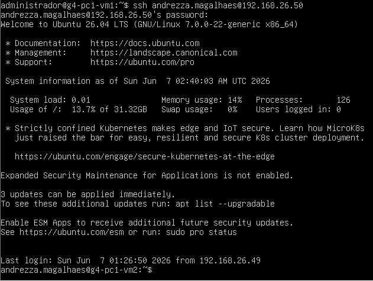

#### Por hostname (g4-pc1-vm2)
```bash
ssh andrezza.magalhaes@g4-pc1-vm2
```
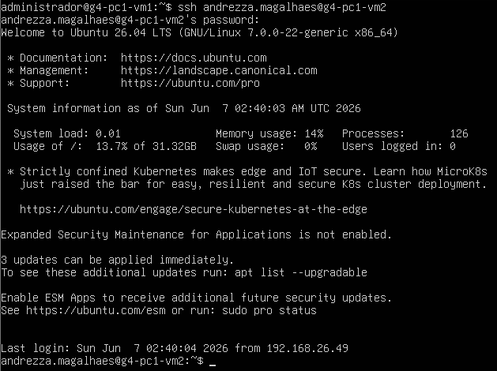

#### Por FQDN
```bash
ssh andrezza.magalhaes@g4-pc1-vm2.grupo4-bsi-26-1.maceio.lab
```
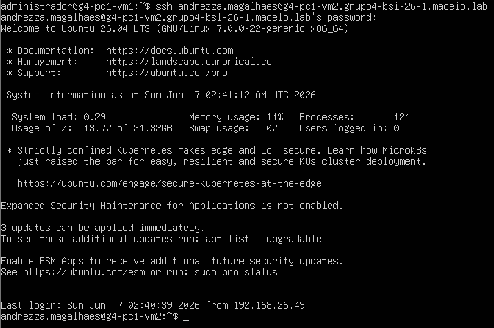

---

## 2. Testes de Isaque (isaque.braga)

### Em G4-PC2-VM1

Os testes foram executados e documentados nas imagens abaixo:
```bash
ssh isaque.braga@192.168.26.51
```
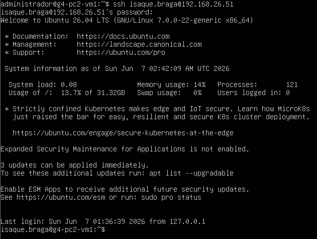

#### Por hostname (g4-pc2-vm1)
```bash
ssh isaque.braga@g4-pc2-vm1
```
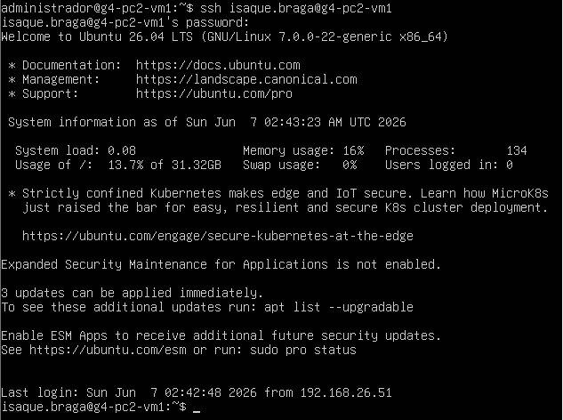

#### Por FQDN
```bash
ssh isaque.braga@g4-pc2-vm1.grupo4-bsi-26-1.maceio.lab
```
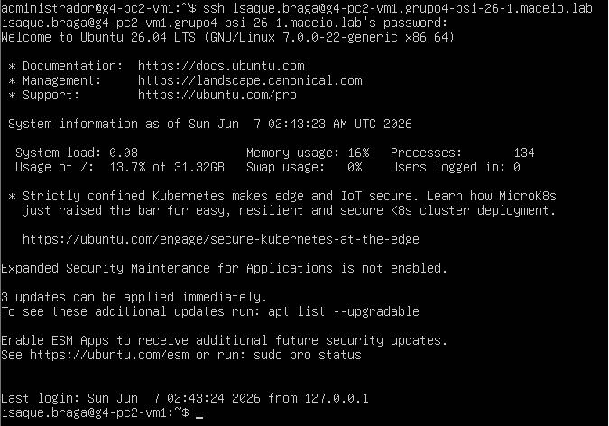

---

### Em G4-PC2-VM2

Os testes foram executados e documentados nas imagens abaixo:
```bash
ssh isaque.braga@192.168.26.52
```
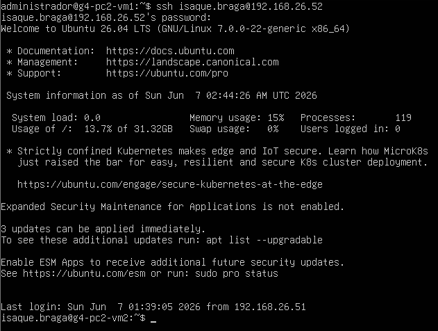

#### Por hostname (g4-pc2-vm2)
```bash
ssh isaque.braga@g4-pc2-vm2
```
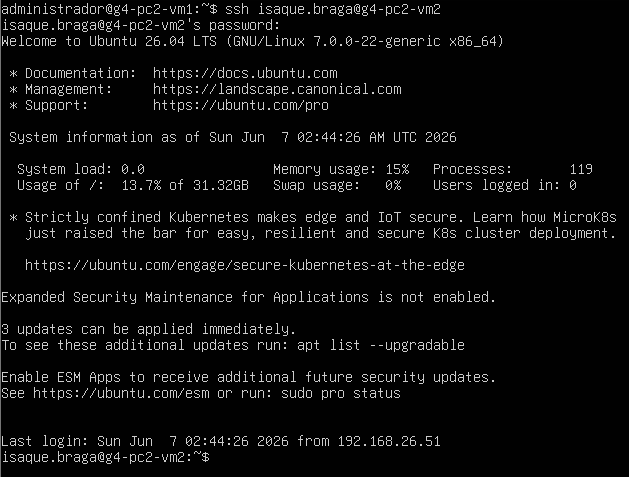

#### Por FQDN
```bash
ssh isaque.braga@g4-pc2-vm2.grupo4-bsi-26-1.maceio.lab
```
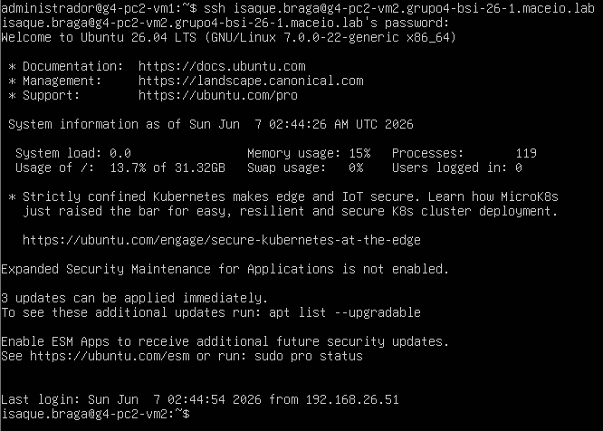

---

## 3. Testes de Maria (maria.santos)

### Em G4-PC3-VM1

Os testes foram executados e documentados nas imagens abaixo:
```bash
ssh maria.santos@192.168.26.53
```
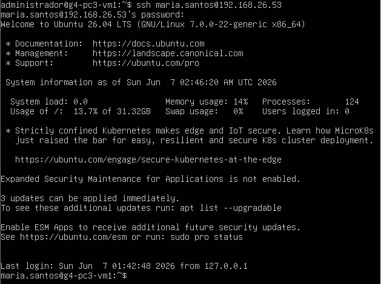

#### Por hostname (g4-pc3-vm1)
```bash
ssh maria.santos@g4-pc3-vm1
```


#### Por FQDN
```bash
ssh maria.santos@g4-pc3-vm1.grupo4-bsi-26-1.maceio.lab
```


---

### Em G4-PC3-VM2

Os testes foram executados e documentados nas imagens abaixo:
```bash
ssh maria.santos@192.168.26.54
```
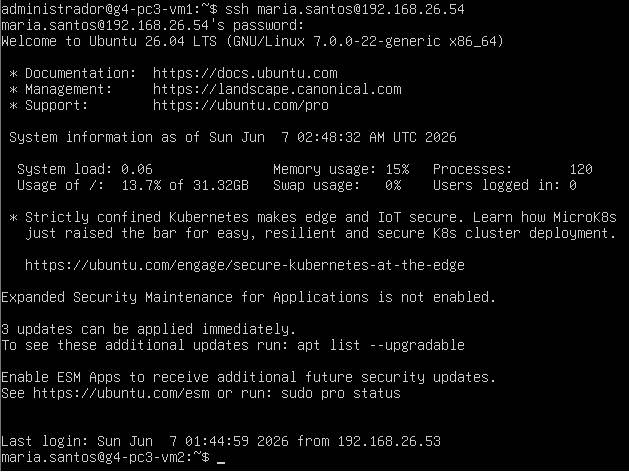

#### Por hostname (g4-pc3-vm2)
```bash
ssh maria.santos@g4-pc3-vm2
```
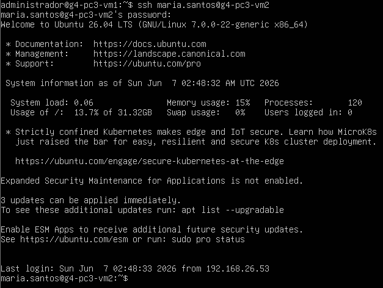

#### Por FQDN
```bash
ssh maria.santos@g4-pc3-vm2.grupo4-bsi-26-1.maceio.lab
```
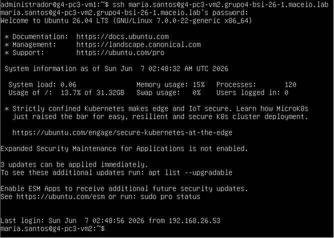

---

## 4. Testes de Renilson (renilson.santos)

### Em G4-PC4-VM1

Os testes foram executados e documentados nas imagens abaixo:
```bash
ssh renilson.santos@192.168.26.55
```
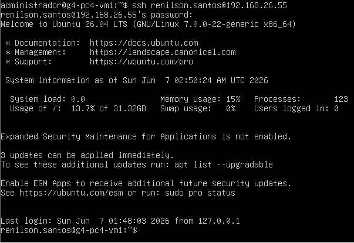

#### Por hostname (g4-pc4-vm1)
```bash
ssh renilson.santos@g4-pc4-vm1
```
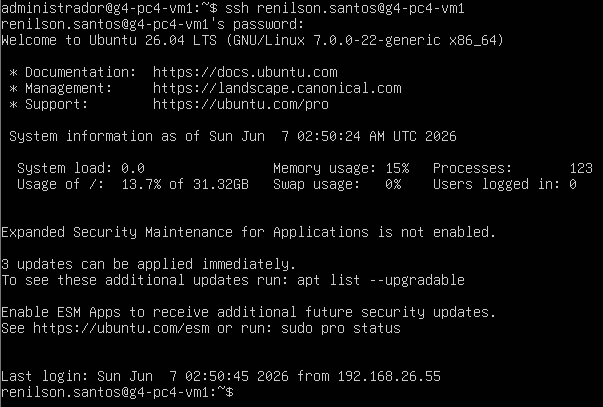

#### Por FQDN
```bash
ssh renilson.santos@g4-pc4-vm1.grupo4-bsi-26-1.maceio.lab
```
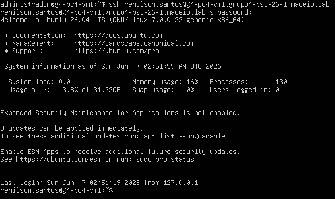

---

### Em G4-PC4-VM2

Os testes foram executados e documentados nas imagens abaixo:
```bash
ssh renilson.santos@192.168.26.56
```
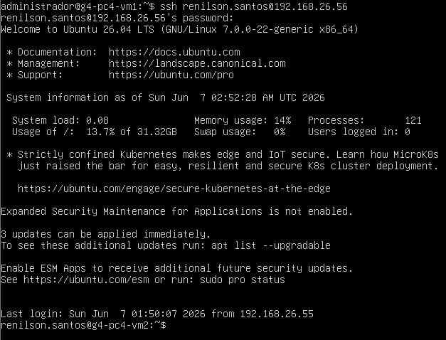

#### Por hostname (g4-pc4-vm2)
```bash
ssh renilson.santos@g4-pc4-vm2
```
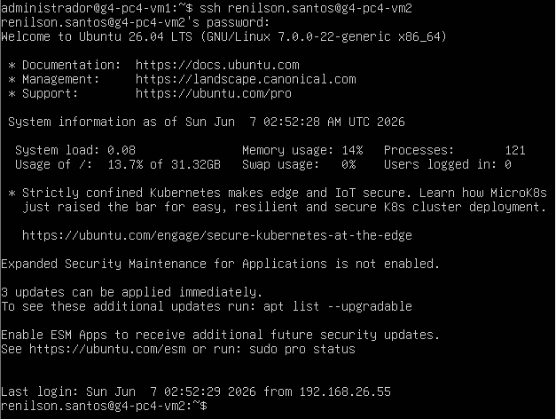

#### Por FQDN
```bash
ssh renilson.santos@g4-pc4-vm2.grupo4-bsi-26-1.maceio.lab
```
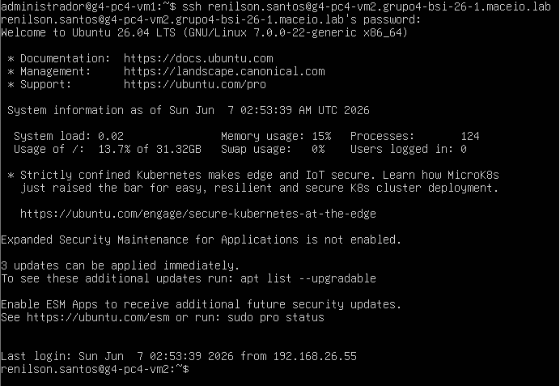

---

## 5. Testes aleatórios cruzados

Testes avulsos onde cada usuário acessa uma VM que não é a sua, usando um tipo de identificação variado. Confirma que todos os usuários foram criados em todas as máquinas e que o SSH funciona entre qualquer par de VMs.

**andrezza.magalhaes → G4-PC2-VM1** (IP)

```bash
ssh andrezza.magalhaes@192.168.26.51
```

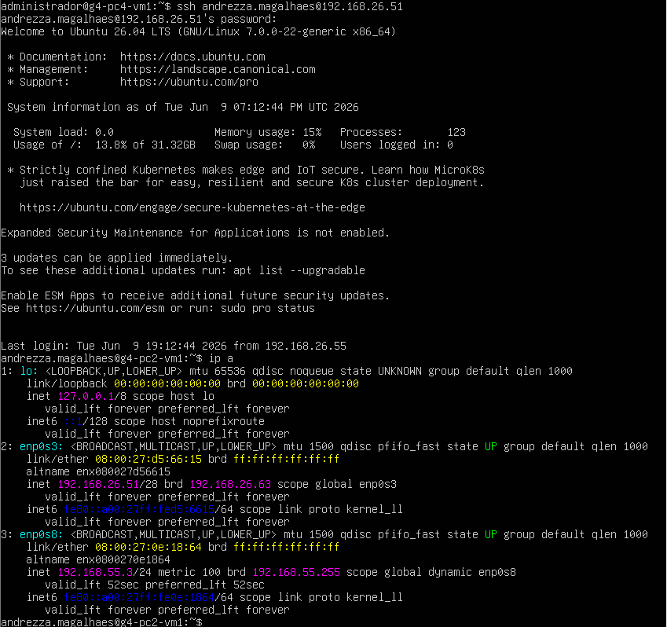

---

**andrezza.magalhaes → G4-PC3-VM2** (FQDN)

```bash
ssh andrezza.magalhaes@g4-pc3-vm2.grupo4-bsi-26-1.maceio.lab
```

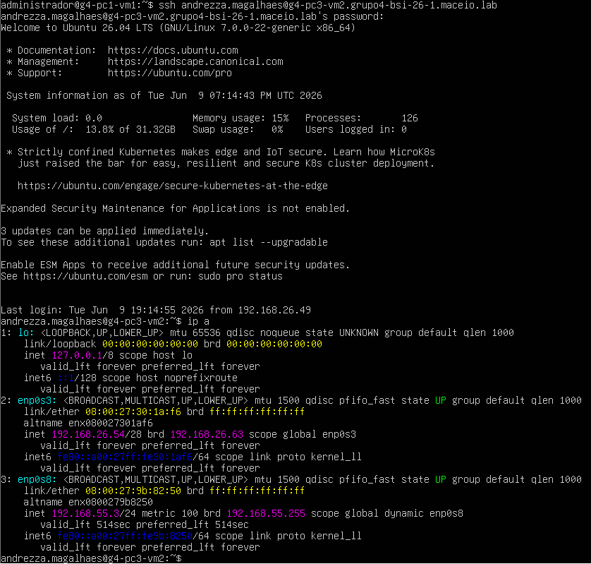

---

**isaque.braga → G4-PC4-VM1** (hostname)

```bash
ssh isaque.braga@g4-pc4-vm1
```

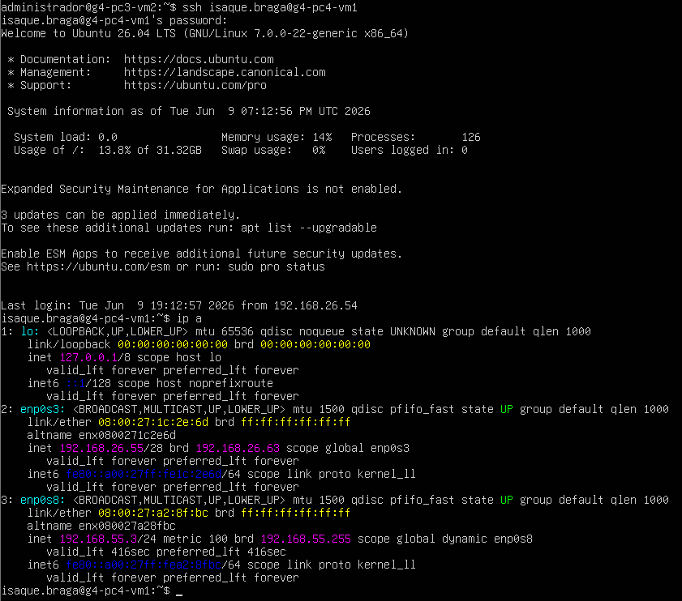

---

**isaque.braga → G4-PC3-VM1** (FQDN)

```bash
ssh isaque.braga@g4-pc3-vm1.grupo4-bsi-26-1.maceio.lab
```

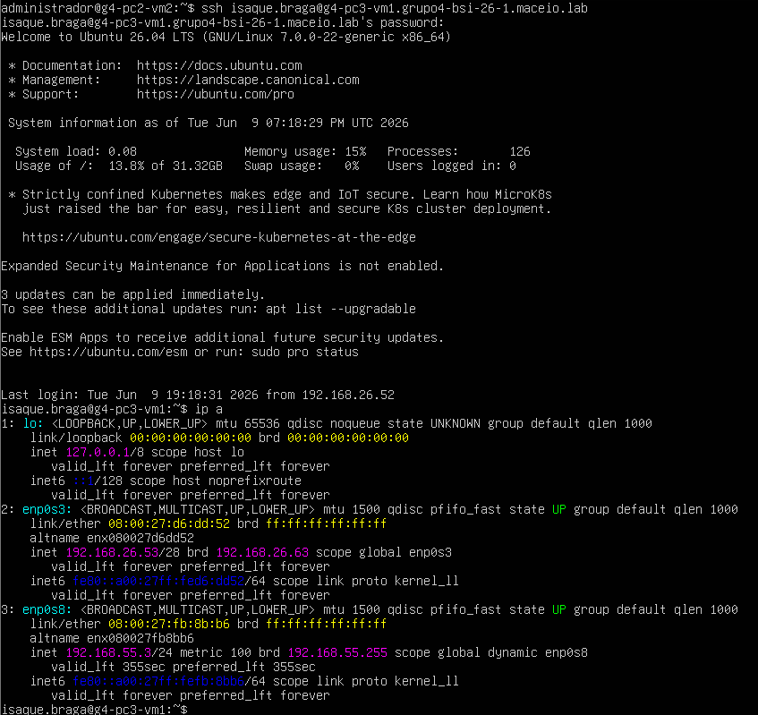

---

**maria.santos → G4-PC1-VM2** (IP)

```bash
ssh maria.santos@192.168.26.50
```

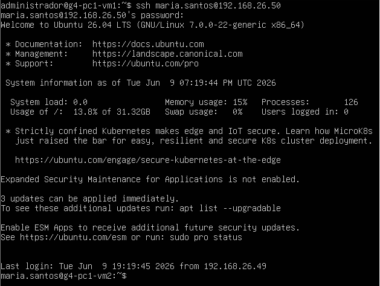

---

**maria.santos → G4-PC4-VM1** (hostname)

```bash
ssh maria.santos@g4-pc4-vm1
```

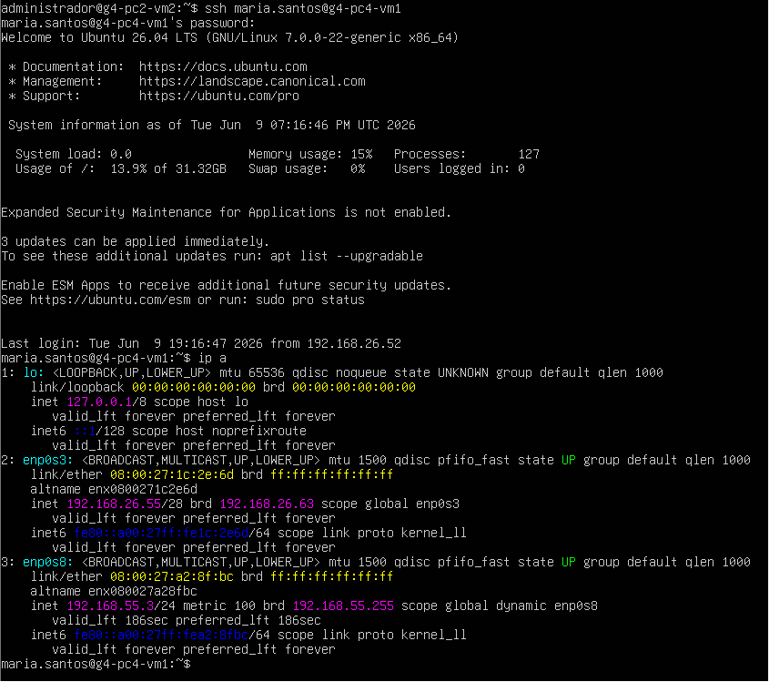

---

**renilson.santos → G4-PC1-VM1** (IP)

```bash
ssh renilson.santos@192.168.26.49
```

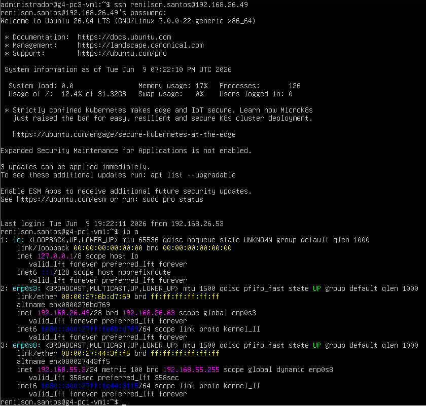

---

**renilson.santos → G4-PC2-VM2** (FQDN)

```bash
ssh renilson.santos@g4-pc2-vm2.grupo4-bsi-26-1.maceio.lab
```

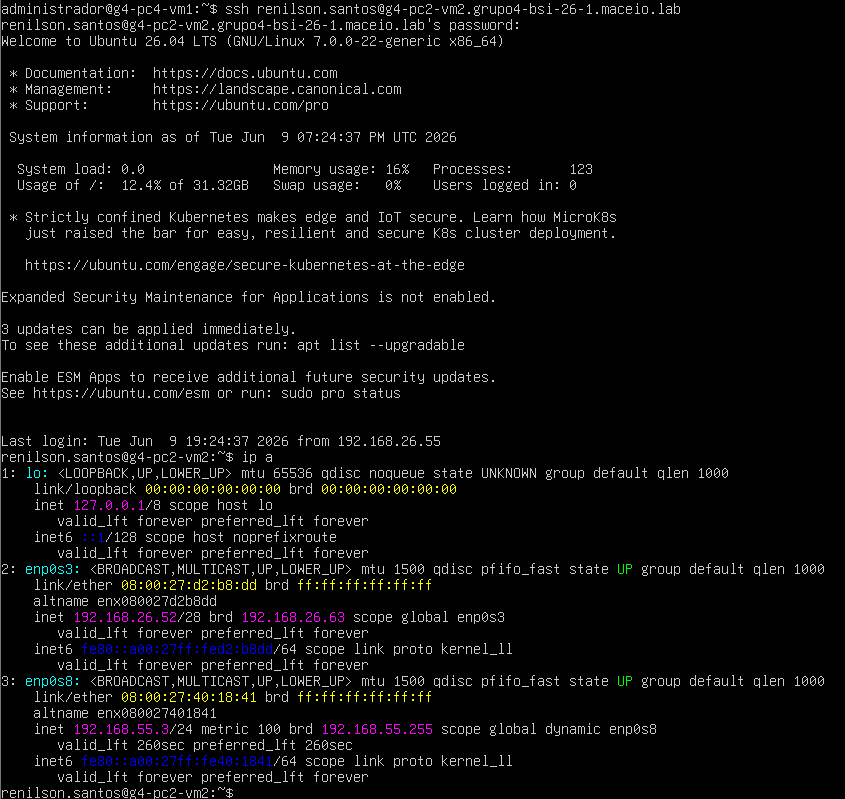

---

## 6. Resumo

**Total de testes:** 32 prints (24 originais + 8 cruzados aleatórios)

Todos os testes de SSH foram bem-sucedidos, demonstrando:
- ✅ Acesso remoto funcionando com todos os usuários
- ✅ Resolução de nomes por IP habilitada
- ✅ Resolução de nomes por hostname habilitada
- ✅ Resolução de nomes por FQDN habilitada
- ✅ Autenticação funcionando em todas as máquinas
- ✅ Usuários criados corretamente em VMs de outros integrantes
- ✅ Comunicação SSH segura estabelecida
